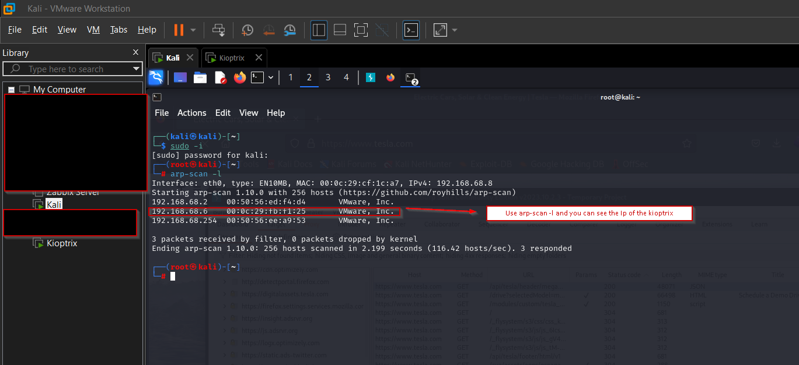
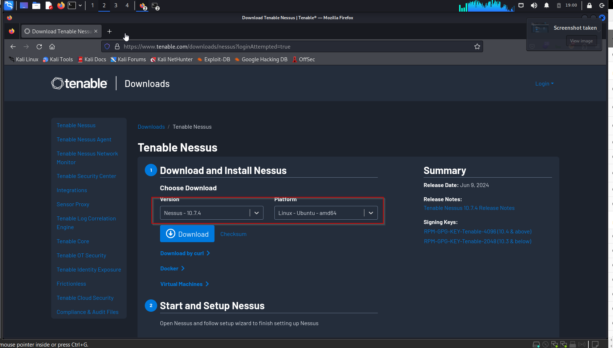

#nmap 
#netdiscover
#arp-scan

## Arp-Scan 

Use `arp-scan -l` in your kali to see the IP of the kioptrix



## Netdiscover

```
netdiscover -r <Network Address/subnetmask>
```


- Result for netdiscover


#### For nmap, its called stealth scanning `nmap -sS` (still detectable)
- `nmap -T4 -p- -A` - default is T4 - T1 is slow and T5 is fast(slow to fast)
- `-p-` means top 1000 ports
- `-p` 80,443 - can scan specific ports
- `-A` - scan everything (version, OS, FIngerprinting,script scanning and traceroute)
- `-sU` - scanning UDP
	- When scanning UDP, use the `nmap -sU -T4 -p 192.168.68.6` - we removed -A cause it may take forever to scan everything cause it has no 3 way handshake
- `-sV` - Probe open ports to determine service/version info
- `-sC` - equivalent to script default

- `nmap` - The network exploration tool and security/port scanner.
- `-sS` - Performs a TCP SYN scan (also known as a "half-open" scan), which is less likely to be detected by the target's firewall or logging system. It works by sending SYN packets and analyzing the response.
- `-Pn` - Treats all hosts as online, skipping host discovery. This is useful if you know the host is up but it isn't responding to ICMP echo requests (ping).
- `-A` - Enables OS detection, version detection, script scanning, and traceroute. This option gives you detailed information about the target system.
- `-p-` - Scans all 65,535 TCP ports on the target. By default, Nmap scans the most common 1,000 ports, but this option extends the scan to every possible port.
- `-oN nmap.txt` - Outputs the scan results to a file named `nmap.txt` in a human-readable format. This is useful for later review and analysis.
- `192.168.64.3` - The target IP address to be scanned.
## Now we will now scan the kioptrix

```
┌──(root㉿kali)-[~]
└─# nmap -T4- -p- -A 192.168.68.6
Host is up (0.0011s latency).                                                                                                                                                                                                               
Not shown: 65529 closed tcp ports (reset)                                                                                                                                                                                                   
PORT      STATE SERVICE     VERSION                                                                                                                                                                                                         
22/tcp    open  ssh         OpenSSH 2.9p2 (protocol 1.99)                                                                                                                                                                                   
| ssh-hostkey:                                                                                                                                                                                                                              
|   1024 b8:74:6c:db:fd:8b:e6:66:e9:2a:2b:df:5e:6f:64:86 (RSA1)                                                                                                                                                                             
|   1024 8f:8e:5b:81:ed:21:ab:c1:80:e1:57:a3:3c:85:c4:71 (DSA)                                                                                                                                                                              
|_  1024 ed:4e:a9:4a:06:14:ff:15:14:ce:da:3a:80:db:e2:81 (RSA)
|_sshv1: Server supports SSHv1
80/tcp    open  http        Apache httpd 1.3.20 ((Unix)  (Red-Hat/Linux) mod_ssl/2.8.4 OpenSSL/0.9.6b)
|_http-server-header: Apache/1.3.20 (Unix)  (Red-Hat/Linux) mod_ssl/2.8.4 OpenSSL/0.9.6b
| http-methods: 
|_  Potentially risky methods: TRACE
|_http-title: Test Page for the Apache Web Server on Red Hat Linux
111/tcp   open  rpcbind     2 (RPC #100000)
| rpcinfo: 
|   program version    port/proto  service
|   100000  2            111/tcp   rpcbind
|   100000  2            111/udp   rpcbind
|   100024  1          32768/tcp   status
|_  100024  1          32768/udp   status
139/tcp   open  netbios-ssn Samba smbd (workgroup: MYGROUP)
443/tcp   open  ssl/https   Apache/1.3.20 (Unix)  (Red-Hat/Linux) mod_ssl/2.8.4 OpenSSL/0.9.6b
|_http-server-header: Apache/1.3.20 (Unix)  (Red-Hat/Linux) mod_ssl/2.8.4 OpenSSL/0.9.6b
| sslv2: 
|   SSLv2 supported
|   ciphers: 
|     SSL2_RC4_64_WITH_MD5
|     SSL2_DES_192_EDE3_CBC_WITH_MD5
|     SSL2_DES_64_CBC_WITH_MD5
|     SSL2_RC4_128_WITH_MD5
|     SSL2_RC2_128_CBC_WITH_MD5
|     SSL2_RC4_128_EXPORT40_WITH_MD5
|_    SSL2_RC2_128_CBC_EXPORT40_WITH_MD5
|_ssl-date: 2024-06-05T21:48:46+00:00; +4s from scanner time.
| ssl-cert: Subject: commonName=localhost.localdomain/organizationName=SomeOrganization/stateOrProvinceName=SomeState/countryName=--
| Not valid before: 2009-09-26T09:32:06
|_Not valid after:  2010-09-26T09:32:06
|_http-title: 400 Bad Request
32768/tcp open  status      1 (RPC #100024)
MAC Address: 00:0C:29:FB:F1:25 (VMware)
Device type: general purpose
Running: Linux 2.4.X
OS CPE: cpe:/o:linux:linux_kernel:2.4
OS details: Linux 2.4.9 - 2.4.18 (likely embedded)
Network Distance: 1 hop

Host script results:
|_smb2-time: Protocol negotiation failed (SMB2)
|_clock-skew: 3s
|_nbstat: NetBIOS name: KIOPTRIX, NetBIOS user: <unknown>, NetBIOS MAC: <unknown> (unknown)

TRACEROUTE
HOP RTT     ADDRESS
1   1.13 ms 192.168.68.6

OS and Service detection performed. Please report any incorrect results at https://nmap.org/submit/ .
Nmap done: 1 IP address (1 host up) scanned in 40.75 seconds

```

