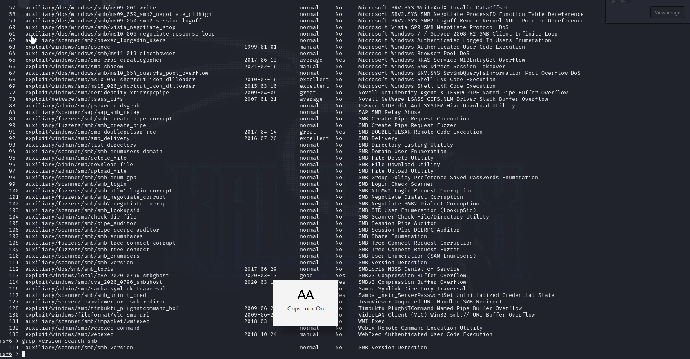

## SMB Enumeration

- port 139
- Metasploit - Exploitation Framework
	-- exploits
	-- auxiliary - scannong and enumeration
	-- post - post exploitation using shell
	-- payloads
	-- encoders
	-- nops
	-- evasion

1. Run msfconsole (this is a metaploit tool)

==========================================================

```
┌──(kali㉿kali)-[~]
└─$ msfconsole
Metasploit tip: Enable HTTP request and response logging with set HttpTrace 
true
                                                  
     ,           ,
    /             \
   ((__---,,,---__))
      (_) O O (_)_________
         \ _ /            |\
          o_o \   M S F   | \
               \   _____  |  *
                |||   WW|||
                |||     |||


       =[ metasploit v6.3.39-dev                          ]
+ -- --=[ 2368 exploits - 1228 auxiliary - 413 post       ]
+ -- --=[ 1391 payloads - 46 encoders - 11 nops           ]
+ -- --=[ 9 evasion                                       ]

Metasploit Documentation: https://docs.metasploit.com/

msf6 > search smb

```

2. check smb version information



```
msf6 > grep version search smb
   111  auxiliary/scanner/smb/smb_version 
msf6 > use auxiliary/scanner/smb/smb_version
msf6 auxiliary(scanner/smb/smb_version) > info

       Name: SMB Version Detection
     Module: auxiliary/scanner/smb/smb_version
    License: Metasploit Framework License (BSD)
       Rank: Normal

Provided by:
  hdm <x@hdm.io>
  Spencer McIntyre
  Christophe De La Fuente

Check supported:
  No

Basic options:
  Name     Current Setting  Required  Description
  ----     ---------------  --------  -----------
  RHOSTS                    yes       The target host(s), see https://docs.metasploit.com/docs/using-metasploit/basics/using-metasploit.html
  THREADS  1                yes       The number of concurrent threads (max one per host)

Description:
  Fingerprint and display version information about SMB servers. Protocol
  information and host operating system (if available) will be reported.
  Host operating system detection requires the remote server to support
  version 1 of the SMB protocol. Compression and encryption capability
  negotiation is only present in version 3.1.1.


View the full module info with the info -d command.

msf6 auxiliary(scanner/smb/smb_version) > 

msf6 auxiliary(scanner/smb/smb_version) > set RHOSTS 192.168.68.6
RHOSTS => 192.168.68.6
msf6 auxiliary(scanner/smb/smb_version) > run

[*] 192.168.68.6:139      - SMB Detected (versions:) (preferred dialect:) (signatures:optional)
**[*] 192.168.68.6:139      -   Host could not be identified: Unix (Samba 2.2.1a)**
[*] 192.168.68.6:         - Scanned 1 of 1 hosts (100% complete)
[*] Auxiliary module execution completed
msf6 auxiliary(scanner/smb/smb_version) > 

```

### From the result of metasploit, we knew that the samba version is 2.2.1a

### Reviewing the notes

	- 80/443 - 192.168.68.6 - 6:32 PM
	- Default webpage - Apache - PHP
	- Information Disclosure - 404 page
	- Information Disclosure - server headers disclose version info
	- 80/tcp    open  http        Apache httpd 1.3.20 ((Unix)  (Red-Hat/Linux) mod_ssl/2.8.4 OpenSSL/0.9.6b)
	- mod_ssl/2.8.4 - mod_ssl 2.8.7 and lower are vulnerable to a remote buffer overflow which may allow a remote shell.
	- Webalizer version 2.01 (http://192.168.68.6/usage/usage_200909.html)
	- SMB - Unix (Samba 2.2.1a)

## Use the smbclient

- Use to attack
- Connect to file share using anonymous access 

#### Using the tool, we found that there are two file shares named IPC$ and ADMIN$

```
smbclient -L \\\\192.168.68.6\\

=================================================================================


┌──(root㉿kali)-[~]
└─# smbclient -L \\\\192.168.68.6\\IPC$
Server does not support EXTENDED_SECURITY  but 'client use spnego = yes' and 'client ntlmv2 auth = yes' is set
Anonymous login successful
Password for [WORKGROUP\root]:

        Sharename       Type      Comment
        ---------       ----      -------
        IPC$            IPC       IPC Service (Samba Server)
        ADMIN$          IPC       IPC Service (Samba Server)
Reconnecting with SMB1 for workgroup listing.
Server does not support EXTENDED_SECURITY  but 'client use spnego = yes' and 'client ntlmv2 auth = yes' is set
Anonymous login successful

        Server               Comment
        ---------            -------
        KIOPTRIX             Samba Server

        Workgroup            Master
        ---------            -------
        MYGROUP              KIOPTRIX

```

Now connect to the ADMIN$  and IPC$ fileshare, remove the `-L`
- Use that we can connect to smb when we connect in \\\\192.168.68.6\\IPC$ 
- ls not allowed in the IPC (NT_STATUS_NETWORK_ACCESS_DENIED listing \*)

```
┌──(root㉿kali)-[~]
└─# smbclient \\\\192.168.68.6\\ADMIN$
Password for [WORKGROUP\root]:
Server does not support EXTENDED_SECURITY  but 'client use spnego = yes' and 'client ntlmv2 auth = yes' is set
Anonymous login successful
tree connect failed: NT_STATUS_WRONG_PASSWORD
                                                                                                                                                                                                                   
┌──(root㉿kali)-[~]
└─# smbclient \\\\192.168.68.6\\IPC$  
Password for [WORKGROUP\root]:
Server does not support EXTENDED_SECURITY  but 'client use spnego = yes' and 'client ntlmv2 auth = yes' is set
Anonymous login successful
Try "help" to get a list of possible commands.
smb: \> 
smb: \> ls
NT_STATUS_NETWORK_ACCESS_DENIED listing \*
smb: \> 


```

