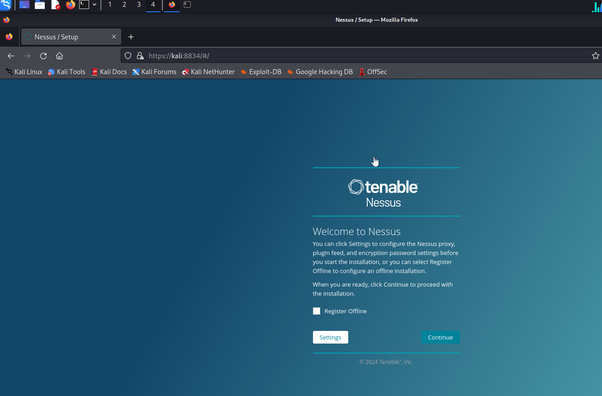
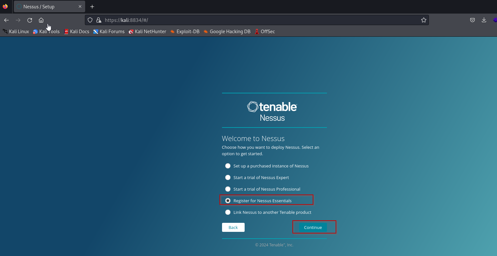
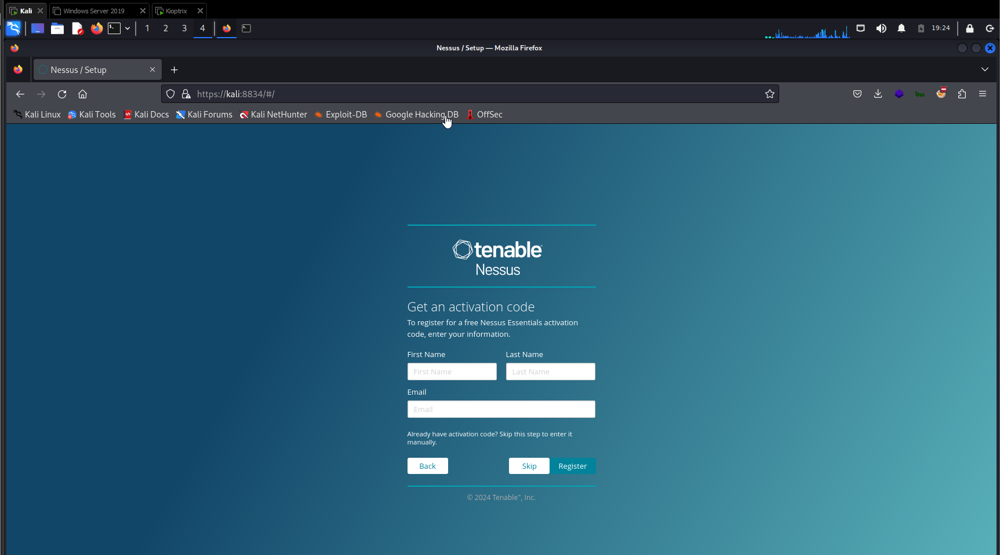
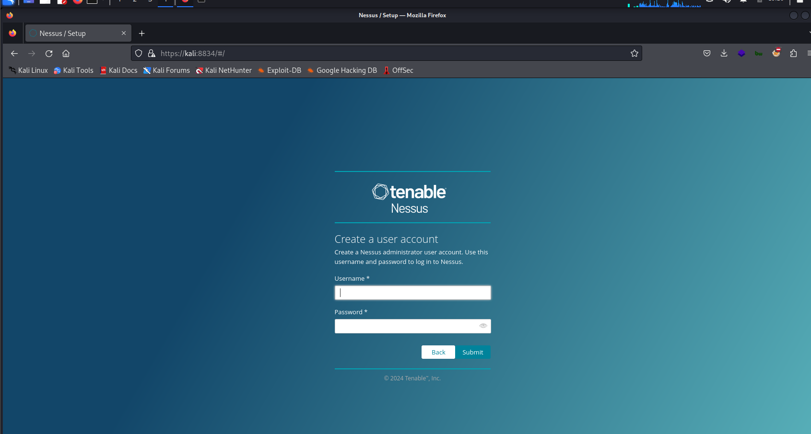
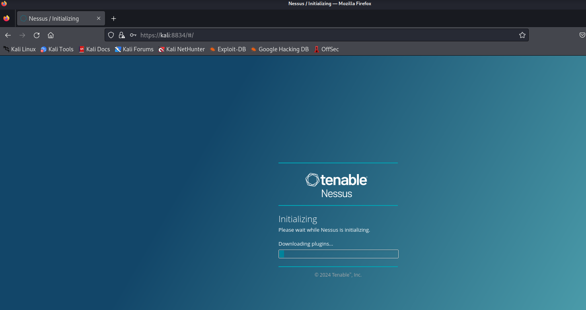
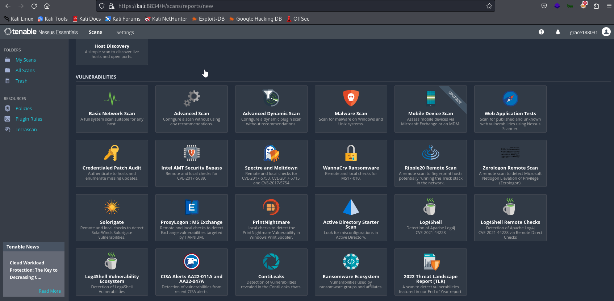
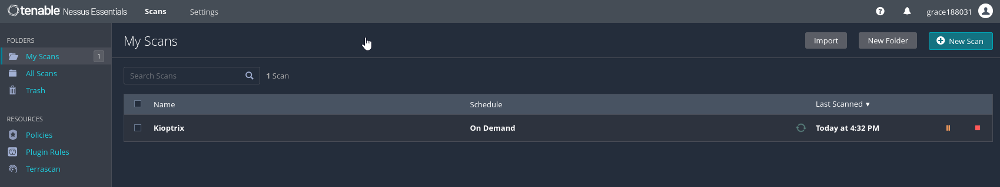

# Scanning with Nessus Part 1


#tenablenessus
#scanvulnerability

1. Download the Nessus in your Kali Linux. It will be saved in /home/kali/Downloads/
	- Look for the Debian


2. Access the command terminal and install the nessus using 

```
dpkg -i Downloads/Nessus-10.7.4-ubuntu1404_amd64.deb
```

Make sure you have enough privilege to install

```
┌──(kali㉿kali)-[~]
└─$ sudo dpkg -i Downloads/Nessus-10.7.4-ubuntu1404_amd64.deb
[sudo] password for kali: 
Selecting previously unselected package nessus.
(Reading database ... 517322 files and directories currently installed.)
Preparing to unpack .../Nessus-10.7.4-ubuntu1404_amd64.deb ...
Unpacking nessus (10.7.4) ...
Setting up nessus (10.7.4) ...
HMAC : (Module_Integrity) : Pass
SHA1 : (KAT_Digest) : Pass
SHA2 : (KAT_Digest) : Pass
SHA3 : (KAT_Digest) : Pass
TDES : (KAT_Cipher) : Pass
AES_GCM : (KAT_Cipher) : Pass
AES_ECB_Decrypt : (KAT_Cipher) : Pass
RSA : (KAT_Signature) : RNG : (Continuous_RNG_Test) : Pass
Pass
ECDSA : (PCT_Signature) : Pass
ECDSA : (PCT_Signature) : Pass
DSA : (PCT_Signature) : Pass
TLS13_KDF_EXTRACT : (KAT_KDF) : Pass
TLS13_KDF_EXPAND : (KAT_KDF) : Pass
TLS12_PRF : (KAT_KDF) : Pass
PBKDF2 : (KAT_KDF) : Pass
SSHKDF : (KAT_KDF) : Pass
KBKDF : (KAT_KDF) : Pass
HKDF : (KAT_KDF) : Pass
SSKDF : (KAT_KDF) : Pass
X963KDF : (KAT_KDF) : Pass
X942KDF : (KAT_KDF) : Pass
HASH : (DRBG) : Pass
CTR : (DRBG) : Pass
HMAC : (DRBG) : Pass
DH : (KAT_KA) : Pass
ECDH : (KAT_KA) : Pass
RSA_Encrypt : (KAT_AsymmetricCipher) : Pass
RSA_Decrypt : (KAT_AsymmetricCipher) : Pass
RSA_Decrypt : (KAT_AsymmetricCipher) : Pass
INSTALL PASSED
Unpacking Nessus Scanner Core Components...

 - You can start Nessus Scanner by typing /bin/systemctl start nessusd.service
 - Then go to https://kali:8834/ to configure your scanner

```

3. Now, start the nessus scanner service in systemd `systemctl start nessusd.service`

```
┌──(kali㉿kali)-[~]
└─$ systemctl start nessusd.service

                                                                                                                                                                                                                   
┌──(kali㉿kali)-[~]
└─$ systemctl status nessusd.service
● nessusd.service - The Nessus Vulnerability Scanner
     Loaded: loaded (/lib/systemd/system/nessusd.service; disabled; preset: disabled)
     Active: active (running) since Wed 2024-06-12 19:10:57 EDT; 13s ago
   Main PID: 10846 (nessus-service)
      Tasks: 13 (limit: 4587)
     Memory: 138.9M
        CPU: 12.865s
     CGroup: /system.slice/nessusd.service
             ├─10846 /opt/nessus/sbin/nessus-service -q
             └─10849 nessusd -q

Jun 12 19:10:57 kali systemd[1]: Started nessusd.service - The Nessus Vulnerability Scanner.
Jun 12 19:10:58 kali nessus-service[10849]: Cached 0 plugin libs in 0msec
Jun 12 19:10:58 kali nessus-service[10849]: Cached 0 plugin libs in 0msec

```

4. Now we can navgate to the nessus scanner website 

```
https://kali:8834/
```

### Once you access the website:

- Click Continue

- Register for Nessus Essential and Click Continue



- Register your name to get an activation code

XGGZ-GEJG-RDKN-M4KH-VSB6

- Create a User account


- Wait for it to download the plugins. It will take minutes


- Now its downloaded and no existing scan

## How to Scan?

1. Click New Scan - Can scan private address and 16 at a time only for essential version
2. Select first the Basic Network Scan 
		- Name: Kioptrix
		- Description Kioptrix
		- Folder My Scans
		- 192.168.68.6
3. Select Schedule - can be automated (we will not enable for now) - (periodic basis). Has SMTP as well of notification
4. Select Discovery - we will choose all ports for now
		- Port Scan (Common Ports)
		- Port scan (all ports)
		- Custom
5. Select scan type - choose Scan for known web vulnerabilities
		- Default
		- Scan for known web vulnerabilities
			- Start crawling from "/"
			- Crawl 1000 pages (max)
			- Traverse 6 directories
			- Test for known vulnerabilities in commonly used web applications
			- Generic web application tests disabled
		- Scan for all web vulnerabilities (quick)
		- Scan for all web vulnerabilities (complex)
		- Custom
6. Report - leave as default
7. Advanced - Default



**NOTE: It will take some time**

