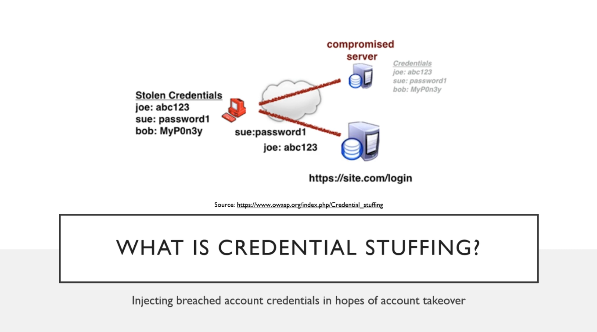
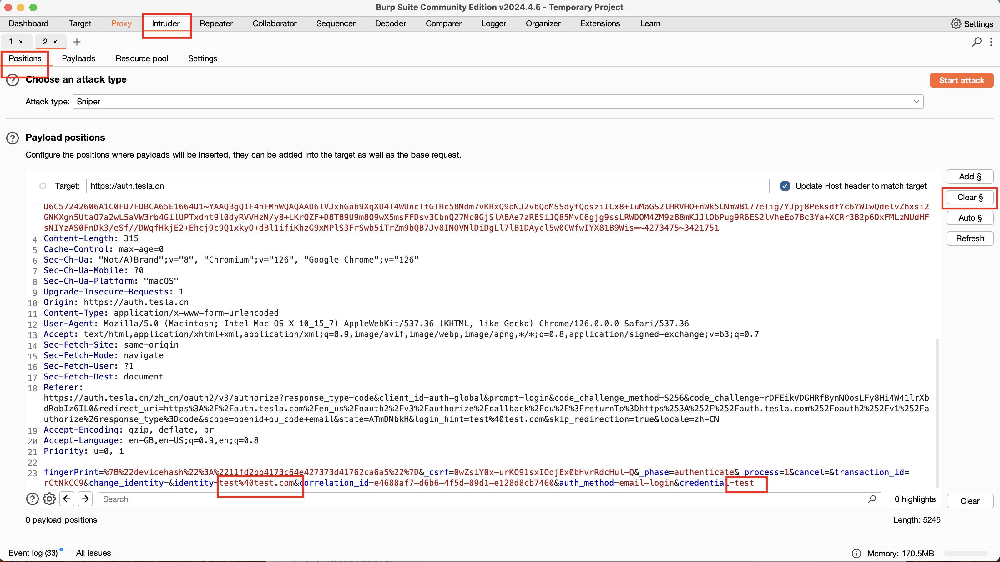
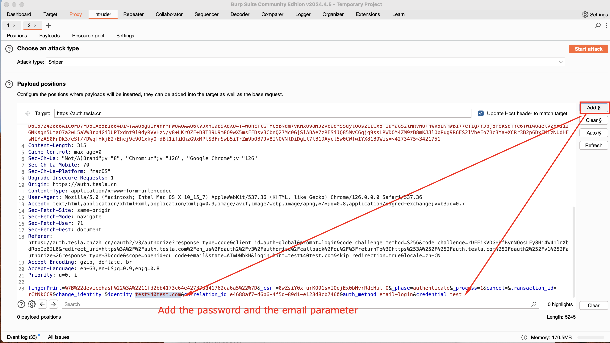
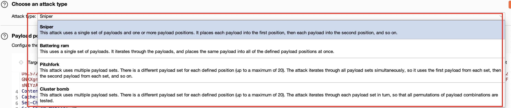
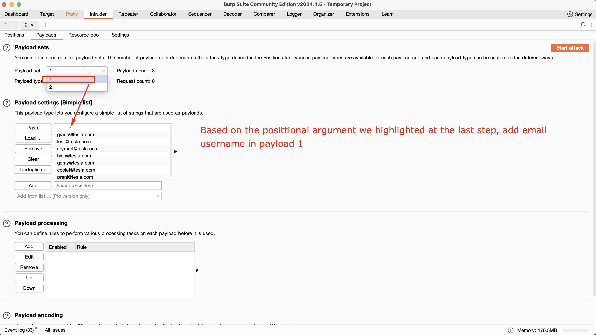
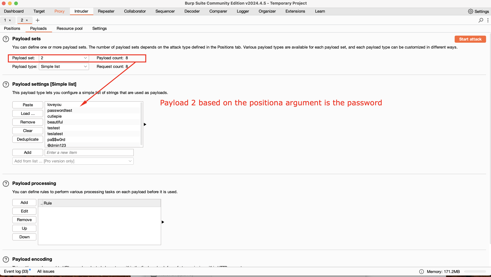
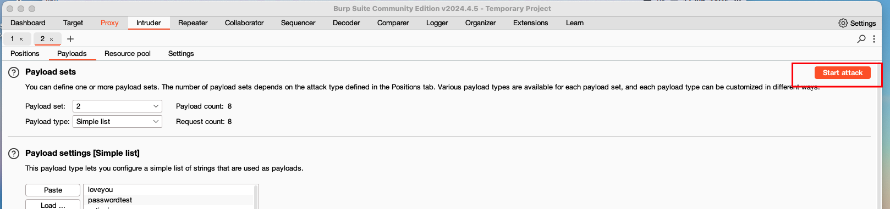
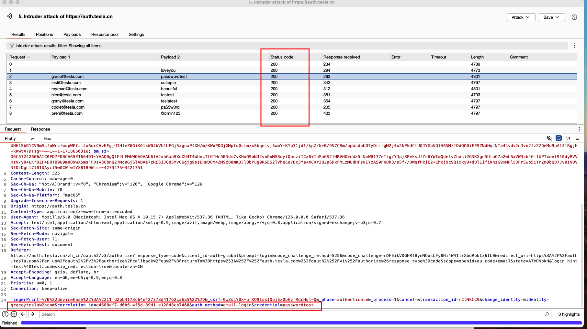
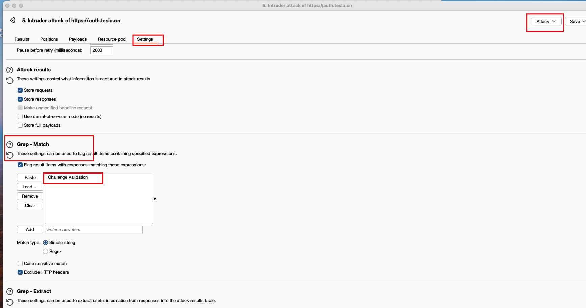
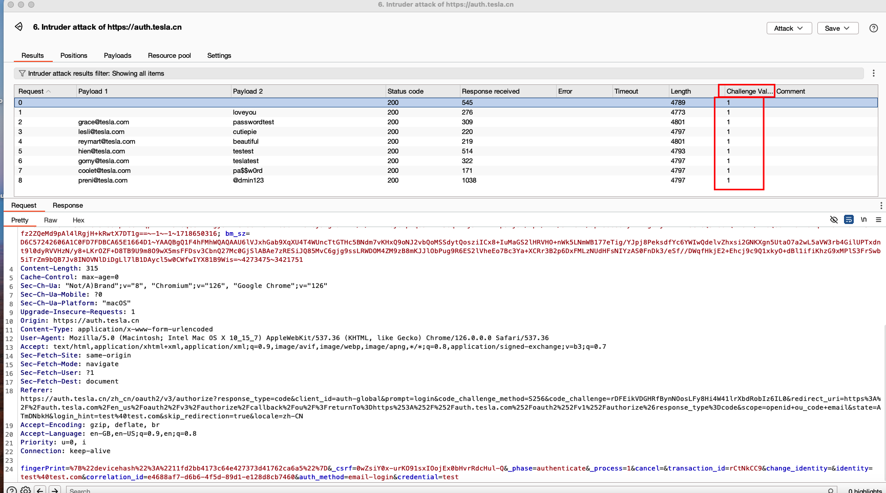

#burpsuite 
#credetialstuffing
#sniper
#foxyproxy #Breachparse
#intruder
#challengevalidation
# Credential Stuffing and Password Spraying

## The result of the accounts we got from Breach parse

=============

1. Turn ON the Foxy Proxy and intercept using the burpsuite
2. Then Login for example in tesla.com and intercept the traffic using the burp suite
3. Monitor POST Intercept Login and send it to intruder

4. Add the password and the email parameter

5. Simulate attack. We will be using PitchFork here

6. Set a payload for Username and password from the breachparse
### Payload 1

### Payload 2

7. Start an Attack

8. Check for any change in respose code "Succesfully Login)" or you can check the return code if it return succesfull

9. We can go to options and filter the traffic that has for example response with String "Challenge Validation"

10. Then it will return a traffic that has specific response "Challenge Validation"

!