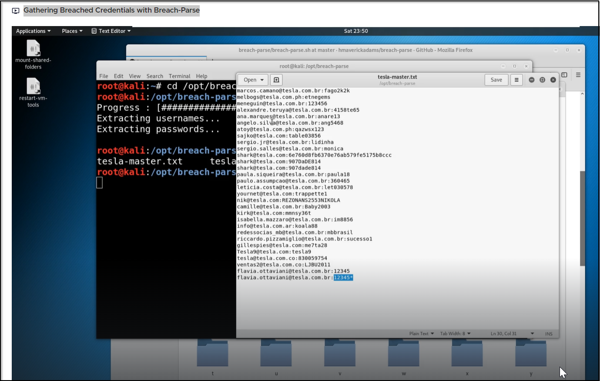

#breachparse


- You need to Fork the Github created by Health. Instruction to copy it in your git is in [[Steps in adding Git from Remote]]
- After you added it in your kali linux, you can now execute it
```
┌──(kali㉿kali)-[/opt/breach-parse]
└─$ sudo ./install.sh
Installation complete. Usage: $ breach-parse


┌──(kali㉿kali)-[/opt/breach-parse]
└─$ ./breach-parse.sh @tesla.com tesla.txt "/tmp/breached-email/"


```
-  Download the 3.2 billion record list

**COMB Magnet:**

magnet:?xt=urn:btih:7ffbcd8cee06aba2ce6561688cf68ce2addca0a3&dn=BreachCompilation&tr=udp%3A%2F%2Ftracker.openbittorrent.com%3A80&tr=udp%3A%2F%2Ftracker.leechers-paradise.org%3A6969&tr=udp%3A%2F%2Ftracker.coppersurfer.tk%3A6969&tr=udp%3A%2F%2Fglotorrents.pw%3A6969&tr=udp%3A%2F%2Ftracker.opentrackr.org%3A1337

Once the torrent is downloaded. Use the following password to unzip:

+w/P3PRqQQoJ6g

- Create folder of breach-email in /tmp file. 
```
┌──(kali㉿kali)-[/tmp]
└─$ mkdir breached-email

┌──(kali㉿kali)-[/opt/breach-parse]
└─$ sudo ./breach-parse.sh @tesla.com tesla.txt "/tmp/breached-email/"

Extracting usernames...
Extracting passwords...


```
- Use gedit tesla-master.txt


