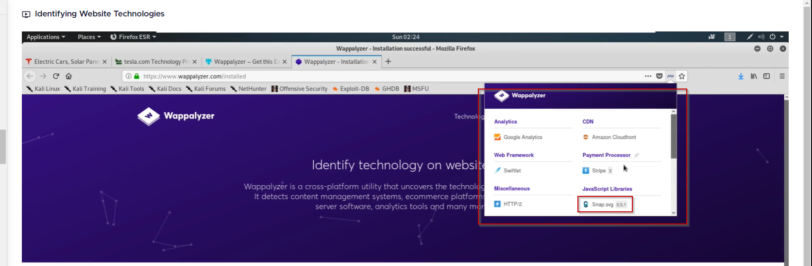
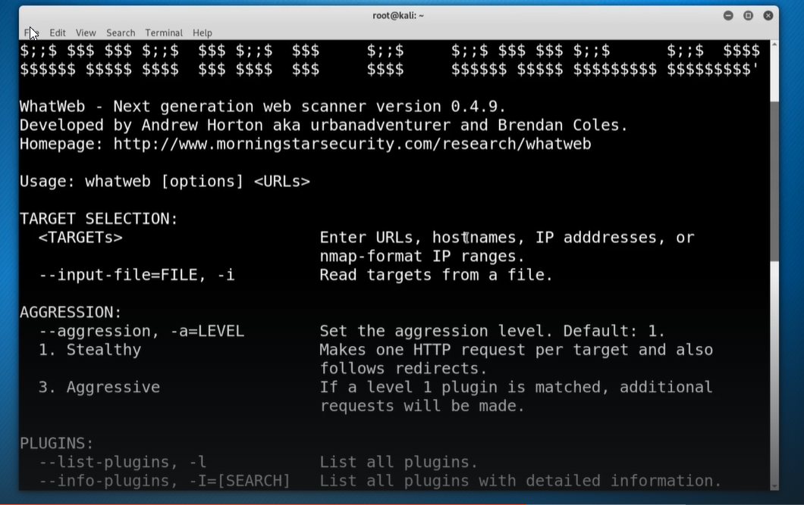
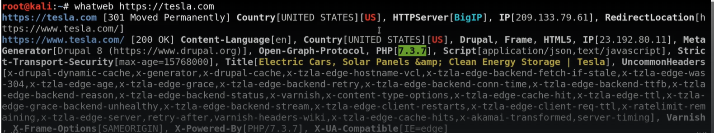

#Wappalyzer
#whatweb
## Using builtwith
	- https://builtwith.com
	- You can check what technology site is using

## Using Wappalyzer

### Its an extension in browser

	- Active type of reconnaisance
	- Check Web server and version used
	- programming language and version
	- Operating System
	- PaaS (e.g amazon)
	- Reverse Proxy used
	- Web Framework
	- Google analytics
	- CDN used
	- Payment Processon
	- Javascript processor
	- HTTP version

- Below is the example of what data a wappalyzer cheks (version and tools)


## Using whatweb

```
└─$ whatweb https://tesla.com                                                           https://tesla.com [403 Forbidden] Akamai-Global-Host, Country[UNITED STATES][US], HTTPServer[AkamaiGHost], IP[23.218.192.46], Strict-Transport-Security[max-age=15768000], Title[Access Denied], UncommonHeaders[x-reference-error,permissions-policy]

```

All you need is to specify a Target



