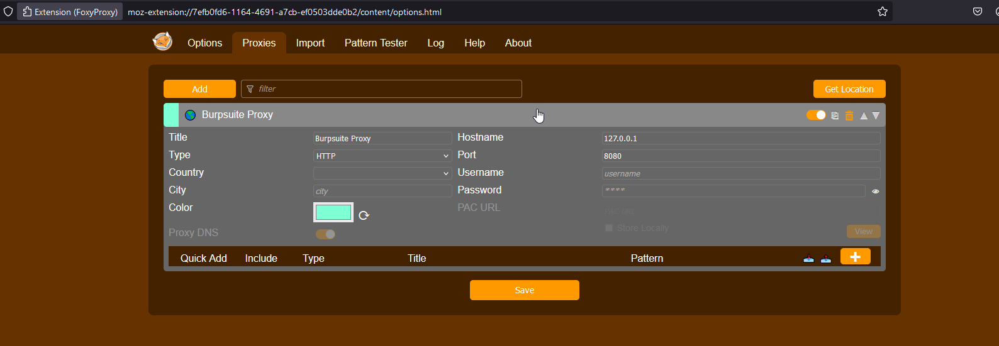
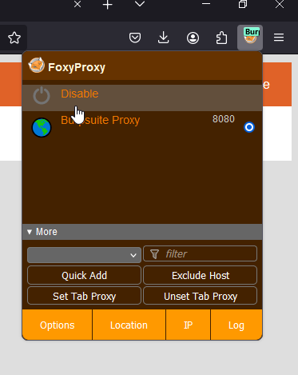

#burpsuite
#foxyproxy
### How to Setup burp suite in your Mozilla firefox browser

1. Go to settings > hover until you find Network settings and set the proxy

2. After setting up the proxy, save the certificate of buprsuite. Go to http://burpsuite ( make sure the proxy is already setup in your browser to access the burpsuite site to download the certificate)

Go to Privacy and security and select View Certificates

Import the burpsuite certificate you downloaded

Now we see that we are intercepting traffic of firefox. Go to Proxy tab of Burpsuite and select Intercept (Make sue that intercept is ON). Just click forward until reaching the tesla.com

You can also select the target and check the specific site directory

## For shortcut in setting up proxy, you can install foxyproxy extension in your browser

Add setting like this

After setting the proxy, pin the extension in the browser and turn on the Burp suite proxy

You can disable it when your finish

