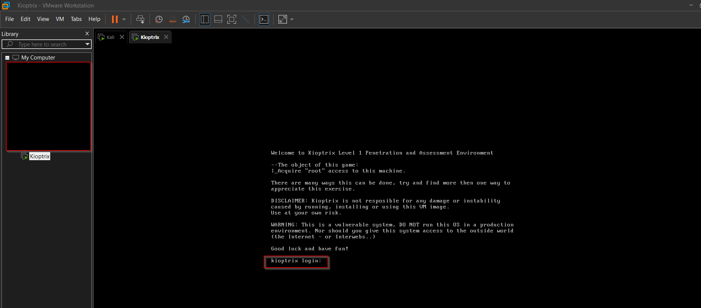

You can find vulnerable machines in kioptrix

You can search in google.com the kioptrix and you will find the kioptrix site.

You can also go to vulnhub.com and find vulnerable machine and download based on difficulty level

tcm-sec download kioptrix as well: you can go to https://www.tcm-sec.com/kioptrix

Login: john
password: TwoCows2

