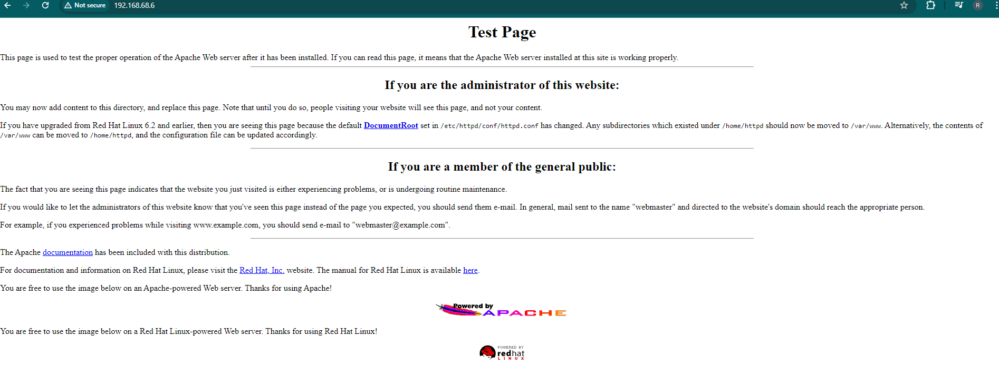
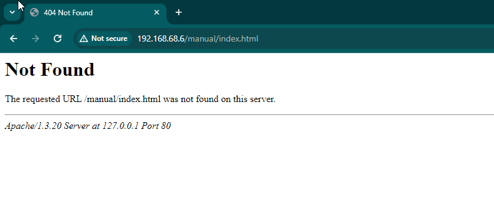

#http
#https
#enumeration 
#nikto
#apache
## Common exploited ports


From the scanning with nmap here are the open ports

`80,443,445` - those commonly found with exploits
smb related expoits is often

Might also check http://192.168.68.6/admin - might see something there
# Investigate the port 80 and 443 first

1. Now turn on your burp suite and access the kioptrix site
	- http://192.168.68.6
	

Checking some links there leads 404 redirection to Not Found. WE can see some relevant information


2. Create Notes
	- 80/443 - 192.168.68.6 - 6:32 PM
	- Default webpage - Apache - PHP
	- Information Disclosure - 404 page
	- Information Disclosure - server headers disclose version info
	- 80/tcp    open  http        Apache httpd 1.3.20 ((Unix)  (Red-Hat/Linux) mod_ssl/2.8.4 OpenSSL/0.9.6b)
	- mod_ssl/2.8.4 - mod_ssl 2.8.7 and lower are vulnerable to a remote buffer overflow which may allow a remote shell.
	- Webalizer version 2.01 (http://192.168.68.6/usage/usage_200909.html)
	
3. Perform Vulnerability Scanning called **nikto**. It s a great tool. `nikto --help`

```
nikto -h https://192.168.68.6
```
```
nikto -h http://192.168.68.6
```

Here is the result

```
──(kali㉿kali)-[~]
└─$ nikto -h https://192.168.68.6
- Nikto v2.5.0
---------------------------------------------------------------------------
---------------------------------------------------------------------------
+ 0 host(s) tested
                         
```

```
┌──(kali㉿kali)-[~]
└─$ nikto -h http://192.168.68.6 
- Nikto v2.5.0
---------------------------------------------------------------------------
+ Target IP:          192.168.68.6
+ Target Hostname:    192.168.68.6
+ Target Port:        80
+ Start Time:         2024-06-05 18:46:31 (GMT-4)
---------------------------------------------------------------------------
+ Server: Apache/1.3.20 (Unix)  (Red-Hat/Linux) mod_ssl/2.8.4 OpenSSL/0.9.6b
+ /: Server may leak inodes via ETags, header found with file /, inode: 34821, size: 2890, mtime: Wed Sep  5 23:12:46 2001. See: http://cve.mitre.org/cgi-bin/cvename.cgi?name=CVE-2003-1418
+ /: The anti-clickjacking X-Frame-Options header is not present. See: https://developer.mozilla.org/en-US/docs/Web/HTTP/Headers/X-Frame-Options
+ /: The X-Content-Type-Options header is not set. This could allow the user agent to render the content of the site in a different fashion to the MIME type. See: https://www.netsparker.com/web-vulnerability-scanner/vulnerabilities/missing-content-type-header/
+ Apache/1.3.20 appears to be outdated (current is at least Apache/2.4.54). Apache 2.2.34 is the EOL for the 2.x branch.
+ OpenSSL/0.9.6b appears to be outdated (current is at least 3.0.7). OpenSSL 1.1.1s is current for the 1.x branch and will be supported until Nov 11 2023.
+ mod_ssl/2.8.4 appears to be outdated (current is at least 2.9.6) (may depend on server version).
+ /: Apache is vulnerable to XSS via the Expect header. See: http://cve.mitre.org/cgi-bin/cvename.cgi?name=CVE-2006-3918
+ OPTIONS: Allowed HTTP Methods: GET, HEAD, OPTIONS, TRACE .
+ /: HTTP TRACE method is active which suggests the host is vulnerable to XST. See: https://owasp.org/www-community/attacks/Cross_Site_Tracing
+ Apache/1.3.20 - Apache 1.x up 1.2.34 are vulnerable to a remote DoS and possible code execution.
+ Apache/1.3.20 - Apache 1.3 below 1.3.27 are vulnerable to a local buffer overflow which allows attackers to kill any process on the system.
+ Apache/1.3.20 - Apache 1.3 below 1.3.29 are vulnerable to overflows in mod_rewrite and mod_cgi.
+ mod_ssl/2.8.4 - mod_ssl 2.8.7 and lower are vulnerable to a remote buffer overflow which may allow a remote shell.
+ ///etc/hosts: The server install allows reading of any system file by adding an extra '/' to the URL.
+ /usage/: Webalizer may be installed. Versions lower than 2.01-09 vulnerable to Cross Site Scripting (XSS). See: http://cve.mitre.org/cgi-bin/cvename.cgi?name=CVE-2001-0835
+ /manual/: Directory indexing found.
+ /manual/: Web server manual found.
+ /icons/: Directory indexing found.
+ /icons/README: Apache default file found. See: https://www.vntweb.co.uk/apache-restricting-access-to-iconsreadme/

+ /test.php: This might be interesting.
+ /wp-content/themes/twentyeleven/images/headers/server.php?filesrc=/etc/hosts: A PHP backdoor file manager was found.
+ /wordpress/wp-content/themes/twentyeleven/images/headers/server.php?filesrc=/etc/hosts: A PHP backdoor file manager was found.
+ /wp-includes/Requests/Utility/content-post.php?filesrc=/etc/hosts: A PHP backdoor file manager was found.
+ /wordpress/wp-includes/Requests/Utility/content-post.php?filesrc=/etc/hosts: A PHP backdoor file manager was found.
+ /wp-includes/js/tinymce/themes/modern/Meuhy.php?filesrc=/etc/hosts: A PHP backdoor file manager was found.
+ /wordpress/wp-includes/js/tinymce/themes/modern/Meuhy.php?filesrc=/etc/hosts: A PHP backdoor file manager was found.
+ /assets/mobirise/css/meta.php?filesrc=: A PHP backdoor file manager was found.
+ /login.cgi?cli=aa%20aa%27cat%20/etc/hosts: Some D-Link router remote command execution.
+ /shell?cat+/etc/hosts: A backdoor was identified.
+ /#wp-config.php#: #wp-config.php# file found. This file contains the credentials.
+ 8908 requests: 0 error(s) and 30 item(s) reported on remote host
+ End Time:           2024-06-05 18:46:58 (GMT-4) (27 seconds)
---------------------------------------------------------------------------
+ 1 host(s) tested

```

4. Copy the nikto scan result. Make directory in your kali

```
mkdir kioptrix
cd kioptrix/
gedit nikto.txt

```