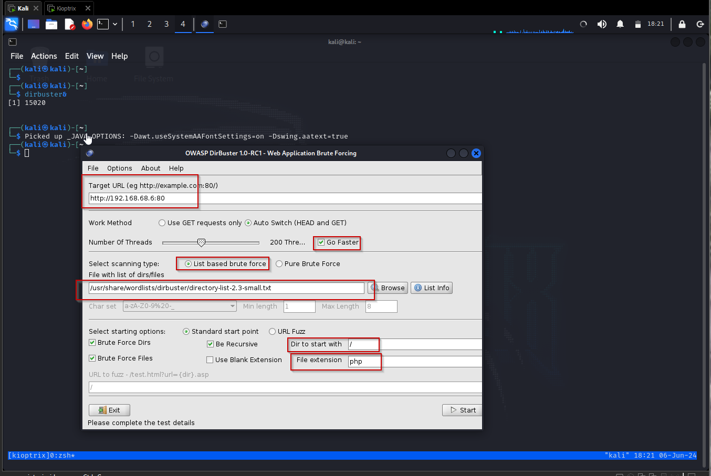
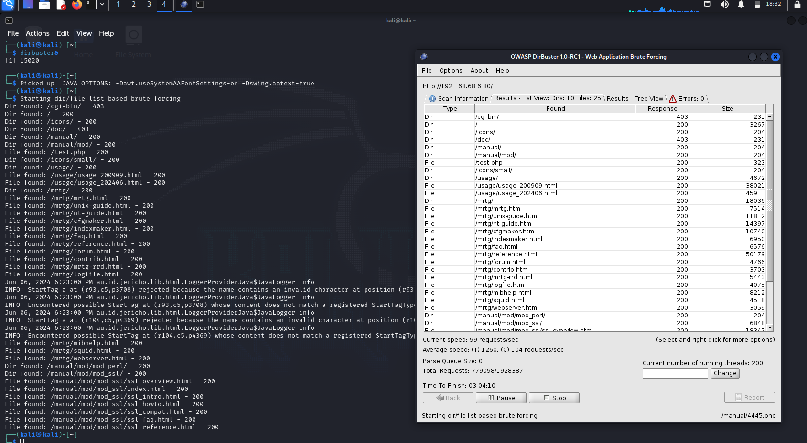
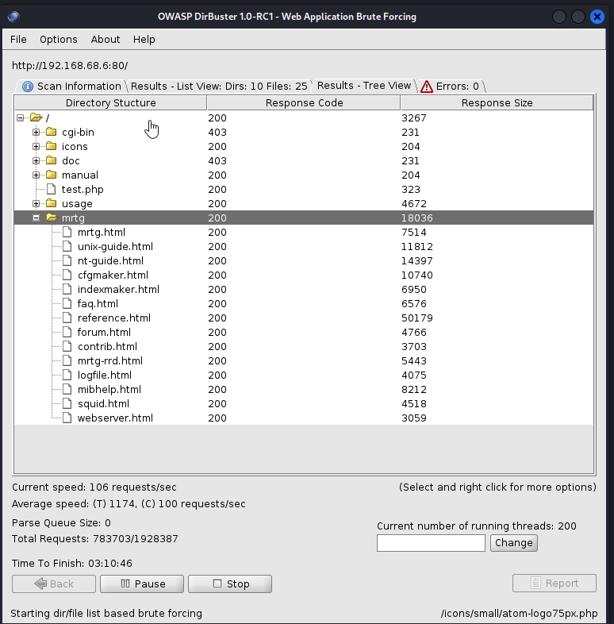
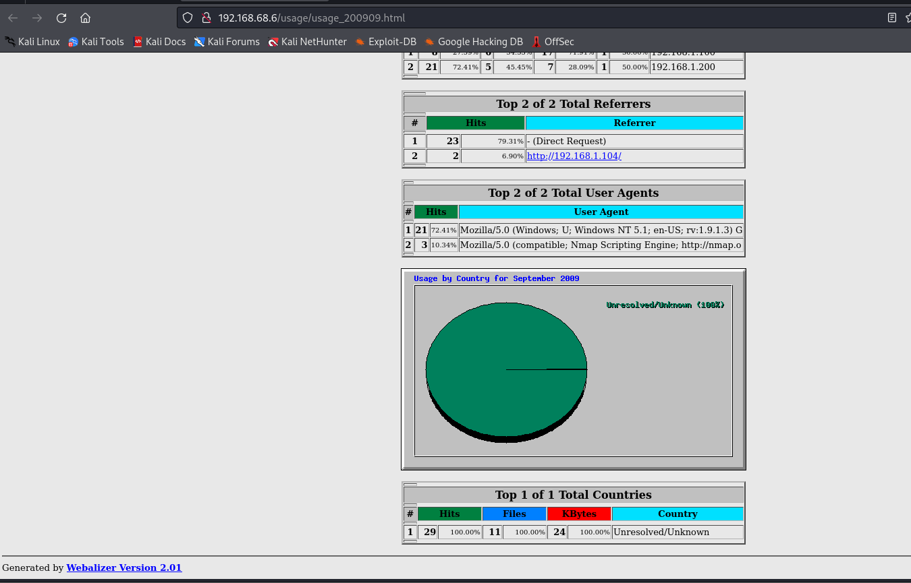
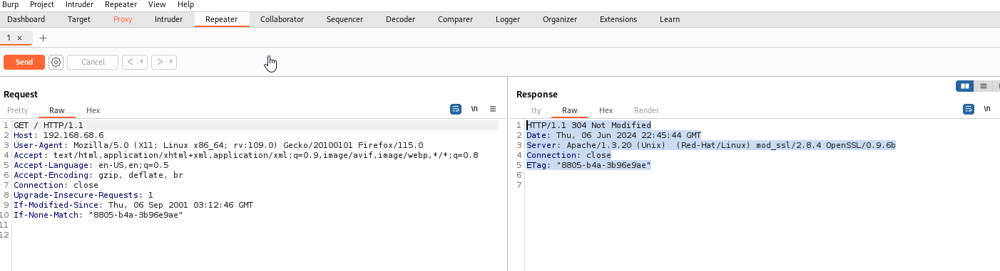
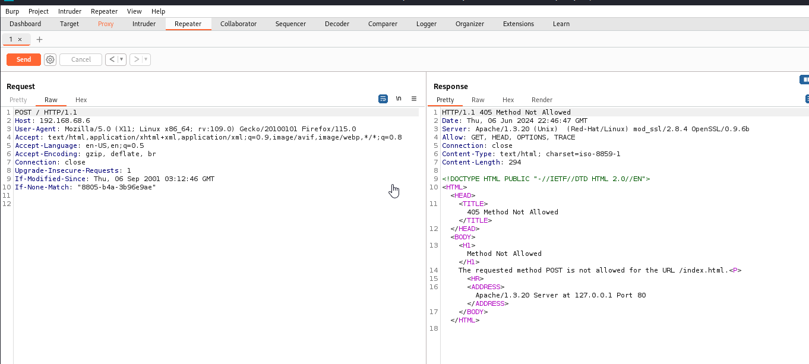
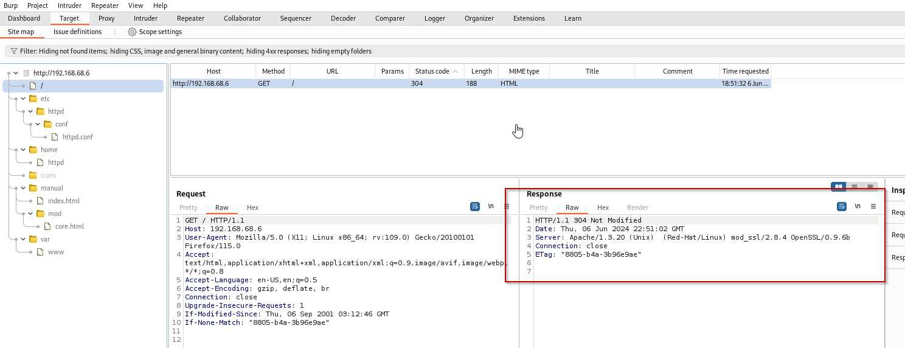

1. Use tool called 
	- **dirbuster** - preferred for this activity
	- **dirb
	- **gobuster**
2. Run the dirbuster. Set the following ( The targethost on port 80, Tick check box for Go Faster, Select List based brute forxe, then browse for /usr/shar/wordlists/dirbuster/directory-list-2.3-small.txt, note you go to medium or interweb directory list if you cant find someting in small-list)
```
dirbuster&
```



This go list all known directory, sample is (/admin page, /cgi, /bin and specific file extension)

- Result View


- Tree View (you can see response code)



From the dirbuster directory go to usage and you will see the version of webalizer
(Webalizer Version 2.01)




## BurpSuite in HTTP enumeration


Intercept in Burp suite and modify send request and check response




You can also send POST and you see that the result is Method NOT ALLOWED



Go to Target, then scope, then add the http://192.168.68.6 and https://192.168.68.6 to limit what we see in the burpsuite. You can see the Apache version in the server header 



