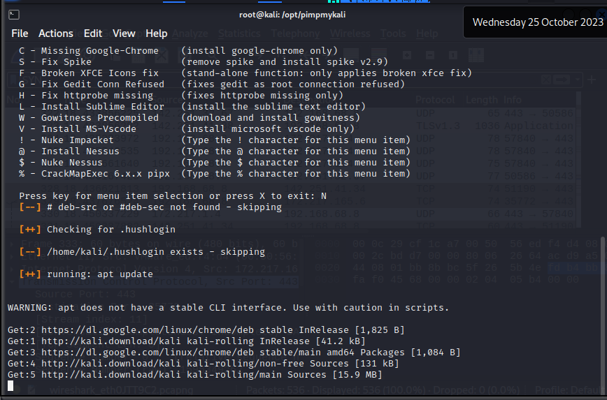
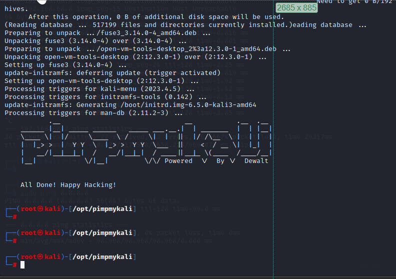

#apt 
#aptinstall
#git
#installfromgit
#pimpmykali

## Install pimpmykali

1. `apt install <service>`
2. `apt update && apt upgrade` - apt update is checking on the repository and upgrade is actually getting the latest version of the service installed
3. Install from Git - pimpmykali
	- Choose N to install tools which will take around 5 minutes
```
┌──(root㉿kali)-[/opt]
└─# git clone https://github.com/Dewalt-arch/pimpmykali.git 
Cloning into 'pimpmykali'...
remote: Enumerating objects: 2690, done.
remote: Counting objects: 100% (778/778), done.
remote: Compressing objects: 100% (276/276), done.
remote: Total 2690 (delta 514), reused 681 (delta 502), pack-reused 1912
Receiving objects: 100% (2690/2690), 471.46 KiB | 124.00 KiB/s, done.
Resolving deltas: 100% (1140/1140), done.
```
 

